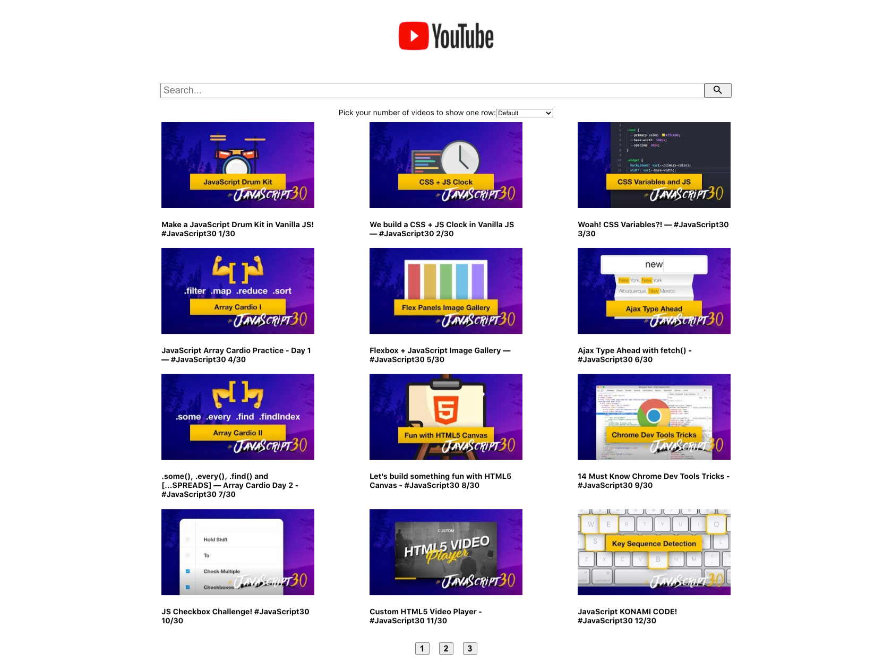

# Youtube API Search with Node.JS and React.JS

### Build a API that consumes YouTube API with Node.js and develop a frontend that list the vidoes from the API. For more detail, please follow the instruction and checkout try it out 😇

## Homepage



## Instructions

```text
Step 1: Inside the server folder, change the name of .env.sample to .env and insert your Youtube API Key.

YOUTUBE_API_KEY=your-api-key

Step 2: Go to the client folder in your terminal and run the app by typing:

NPM Start

Step 3: Go to the server folder in your terminal and run the server by typing:

npm run dev

Step 4: Open your browser and enter: http://localhost:3000/
```
